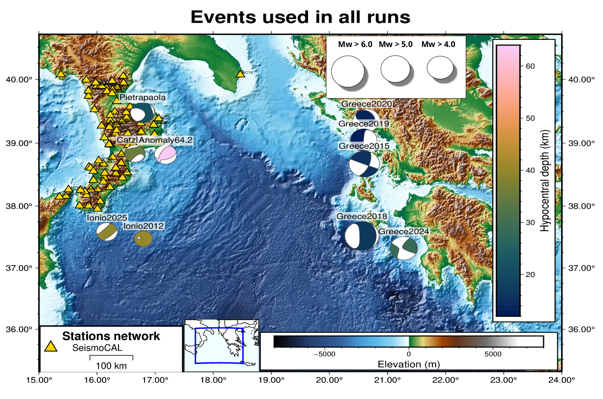

# ionianbasin
##### This repository collects all material related to my Master's thesis work for the Ionian basin region. If you have problems executing the code and reproducing the outputs check inside the folder specs/ about the flags/options used. If you still have issues contact me. The goal is always to start from the end point at which I stopped. derose.fr@gmail.com
##### The aim is to maintain a reproducible and transparent archive of the numerical tests conducted for regional waveform modeling studies in this area. I hope whichever user interested in these kind of simulations will find this repository useful for its studies.
***
### Uploaded September 2025. Francesco De Rose. Cosenza, Calabria.
* Everything in this page is free to produce, share and build for one's needs.
* Time and Location - Cosenza, Calabria 22092025.
***
---------------------
#### Closeup view of the interested region: the southern part of Italy, Calabria and most of the Ellenic arc.

Regional earthquake animation EQ20250416012608.7 Mw 4.7 39.0 km depth shown with Paraview.

This main branch includes:
        
    Thesis (.tex, .pdf and all other outputs from Texmaker 
    as well as figures .png & jpegs) (work in progress...)

    Thesis presentation (.odp with TexMaths extension, be sure to 
    have that extension installed otherwise some figures won't render; work in progress...)

    Description of all PCs used throughout the thesis work (configuration flags selected 
    during the software setup, CPU, RAM usage, time for each run etc.): #check specs/#

    Complete simulation setup parameter files related to SPECFEM3D Cartesian
    (Par_file, CMTSOLUTION, STATIONS, STFext etc.); #check parameters/#

    Meshing and model-building utilities (many thanks to Dr. Rafael Abreu for 
    the help in the mesh modelling); #check meshing/# 

    3D and tomographic velocity model scripts 
    (mostly GMT related codes); #check models/#

    Post-processing and plotting scripts (mostly JupyterNotebook, gnuplot and python);
    #check the folder pstprcss/ and fgs/#

    Documentation and notes on simulation parameters and workflow
    (all the articles that have been read during the thesis writing). #check refs/# 
---------------------
Simulations were run with the aid of Newton cluster, Rende(CS) (http://newton-1.hpcc.unical.it) and with the SPECFEM3D software (https://specfem.org/) and the Mecenate PC lab (http://www.sismocal.org/)
SPECFEM3D Cartesian has been used ( Komatitsch and Tromp, 2002; Komatitsch and Tromp, 2002) published under the GPL 2 license.
Dr. Rafael Abreu's help (IPGP, https://rafaelabreuseis.github.io/)  with the meshing modeling python code and relative notebook is greatly appreciated. All figures have been made using SAC and GMT.
* GMT - The Generic Mapping Tools, Version 6.5.0 [64-bit] [12 cores] (c) 1991-2024 The GMT Team (https://www.generic-mapping-tools.org/team.html).
* SEISMIC ANALYSIS CODE [11/11/2013 (Version 101.6a)]  Copyright 1995 Regents of the University of California (http://ds.iris.edu/ds/nodes/dmc/forms/sac/)
  
Uploaded in September 2025.

* Komatitsch, D.; Tromp, J. (2002a), Spectral-element simulations of global seismic wave propagation-I. Validation, Geophysical Journal International, 149 (2) , 390-412, doi: 10.1046/j.1365-246X.2002.01653.x, url: http://doi.wiley.com/10.1046/j.1365-246X.2002.01653.x
* Komatitsch, D.; Tromp, J. (2002b), Spectral-element simulations of global seismic wave propagation–II. Three-dimensional models, oceans, rotation and self-gravitation, Geophysical Journal International, 150 (1) , 303-318, url: https://academic.oup.com/gji/article/150/1/303/593406
* Komatitsch, D.; Vilotte, J.-P.; Tromp, J.; Ampuero, J.-P.; Bai, K.; Basini, P.; Blitz, C.; Bozdag, E.; Casarotti, E.; Charles, J.; Chen, M.; Galvez, P.; Goddeke, D.; Hjorleifsdottir, V.; Labarta, J.; Le Goff, N.; Le Loher, P.; Lefebvre, M.; Liu, Q.; Luo, Y.; Maggi, A.; Magnoni, F.; Martin, R.; Matzen, R.; McRitchie, D.; Meschede, M.; Messmer, P.; Michea, D.; Nadh Somala, S.; Nissen-Meyer, T.; Peter, D.; Rietmann, M.; de Andrade, E.S. ; Savage, B.; Schuberth, B.; Sieminski, A.; Strand, L.; Tape, C.; Xie, Z.; Zhu, H. (9999), SPECFEM3D Cartesian [software], doi: 8926d3d3354b9fde5fc3b356189b8ddc4c3a30e5, url: https://geodynamics.org/cig/software/specfem3d/

